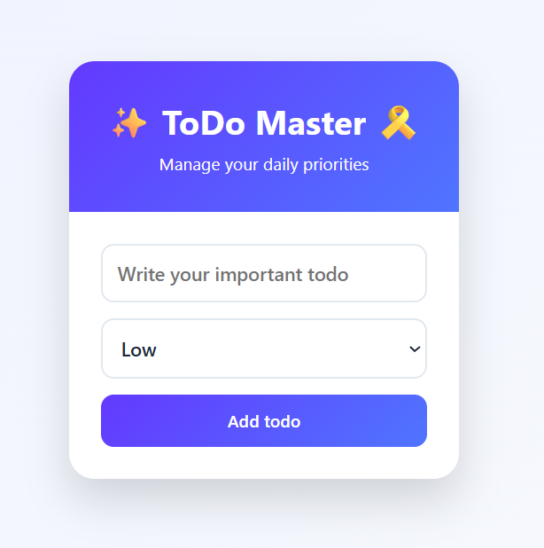
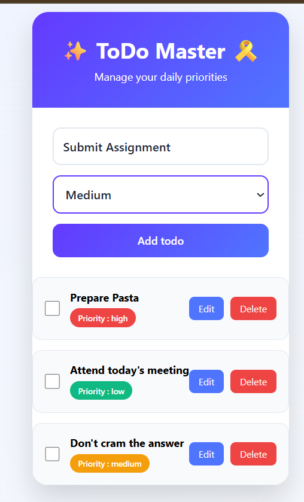
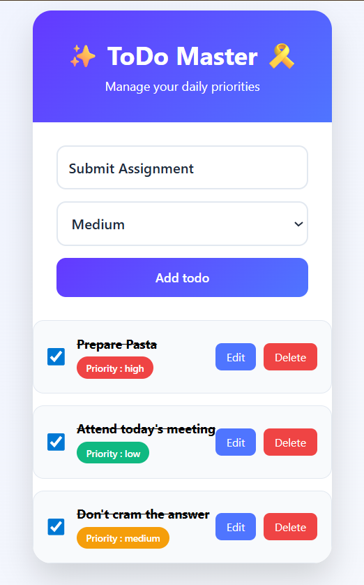

## Setup and Installation

### 1. Create a React Application

This project was initialized using **Vite**, a modern build tool that provides fast development server startup and optimized production builds for React applications.

Run the following command to create a new React project:

```bash
npm create vite@latest
```

During the setup process:

1. Enter your project name.
2. Select the desired module type.
3. Choose **React** as the framework.
4. Select **JavaScript** as the variant.

### 2. Install Dependencies

Navigate to the project directory and install all required dependencies:

```bash
cd Simple_to_do_List
npm install
```

### 3. Run the Development Server

Start the development server to verify that the application is running correctly:

```bash
npm run dev
```

After the server starts, open the URL displayed in the terminal (typically `http://localhost:5173`) in your browser.

If the default Vite React page is displayed, the setup has been completed successfully.

# Simple To-Do List Application

A simple and user-friendly To-Do List application built using **React** and **Vite**. The application allows users to add, edit, delete, and mark tasks as completed while managing task priorities.

---

## Features

- Add new tasks
- Edit existing tasks
- Delete tasks
- Mark tasks as completed
- Assign task priorities (High, Medium, Low)
- Dynamic task rendering using React state
- Responsive and visually appealing UI

---

## Technologies Used

- React
- Vite
- JavaScript
- CSS

---

## Project Structure

```text
Simple_to_do_List/
│
├── public/
│   ├── favicon.svg
│   └── icons.svg
│
├── src/
│   ├── assets/
│   │
│   ├── components/
│   │   ├── AddTodo.jsx
│   │   ├── TodoItemList.jsx
│   │   ├── Header.jsx
│   │   └── TodoItem.jsx
│   │
│   ├── App.jsx
│   ├── index.css
│   └── main.jsx
│
├── .gitignore
├── eslint.config.js
├── index.html
├── package.json
├── package-lock.json
├── README.md
└── vite.config.js
```

---

## Component Structure

### App Component
- Manages application state.
- Stores all tasks.
- Handles add, update, delete, and completion functionality.

### Header Component
- Displays application title and description.

### AddTodo Component
- Provides task input form.
- Allows selection of task priority.

### TodoItemList Component
- Displays all tasks dynamically.

### TodoItem Component
- Displays a single task.
- Handles edit, delete, and completion actions.

---

## How to Run & Install

### Clone the Repository

```bash
git clone https://github.com/nihal-patidar/Simple_todo_List.git
```

### Navigate to Project Folder

```bash
cd Simple_to_do_List
```

### Install Dependencies

```bash
npm install
```

### Run Development Server

```bash
npm run dev
```

After running the command, open the URL displayed in the terminal (usually):

```text
http://localhost:5173
```

---

## Screenshots

### Home Page

Add a screenshot here:



### Add Task

Add a screenshot here:



### Task List

Add a screenshot here:


### Completed Task

Add a screenshot here:



---

## GitHub Repository
    ```
    https://github.com/nihal-patidar/Simple_todo_List.git

---

## Author

**Name:** Nihal Patidar

**Course:** React Pratice

**Technology Stack:** React + Vite + JavaScript + CSS